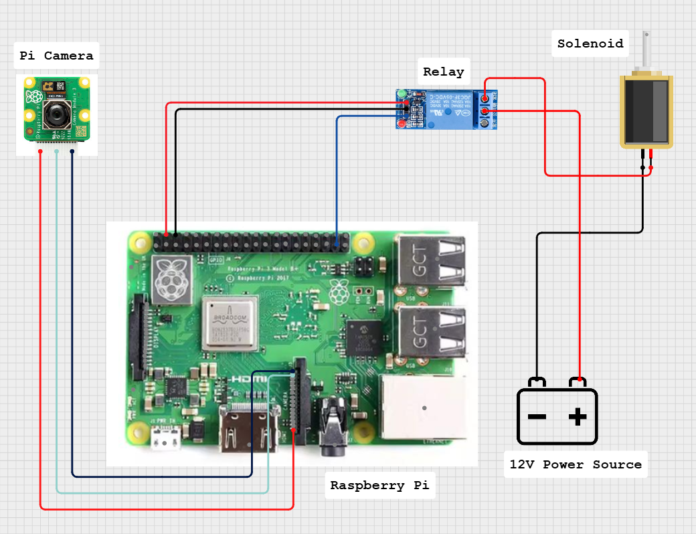

# ReFace-Door
Face Recognition Door Lock system using Raspberry Pi with IoT-Based
# Raspberry Pi Face Recognition Door Lock

Face recognition door lock built with Raspberry Pi 3, Pi Camera NoIR, OpenCV LBPH, relay-based solenoid control, LCD status display, limit switch feedback, and Telegram alerts for unauthorized access attempts.

## Overview

This project was developed as a smart door lock prototype that can:

- register an authorized user's face
- train a face recognition model
- unlock a door when an authorized face is detected
- keep the door unlocked until the door closes again
- show system status on an I2C LCD
- send Telegram notifications for repeated unauthorized detections
- start or stop the system with a physical switch

The current working approach uses OpenCV LBPH face recognition because it runs more comfortably on Raspberry Pi 3 than heavier deep-learning models.

## Main Features

- Face registration with captured grayscale face images
- Model training with OpenCV LBPH face recognizer
- Real-time face recognition using Pi Camera NoIR
- Relay control for a 12V solenoid door lock
- Limit switch logic so the door re-locks only after it is closed
- I2C LCD messages such as `System Ready`, `Welcome`, and `Door Locked`
- Telegram bot alerts for unauthorized users
- Cooldown logic to reduce repeated unlocks and repeated Telegram spam
- Switch-based start and stop control

## Core Files

These are the main files for the finished version of the project:

- `main.py`  
  Main runtime for face recognition, relay control, LCD display, limit switch handling, and Telegram notification.

- `register_face.py`  
  Captures and stores face samples for an authorized user.

- `train_model.py`  
  Trains the LBPH face recognition model from saved images.

- `switch_controller.py`  
  Starts or stops the system when the external switch is flipped.

Supporting files:

- `face_lock_common.py`
- `start_switch_controller.sh`
- `requirements.txt`
- `.gitignore`

## Hardware Used



- Raspberry Pi 3
- Pi Camera NoIR
- 1-channel relay module
- 12V solenoid lock
- external 12V power supply for solenoid
- I2C LCD display
- limit switch module
- start/stop switch
- jumper wires and breadboard or terminal connections

## Wiring Summary

GPIO numbering in the code uses BCM mode.

### Relay

- Relay `VCC` -> Raspberry Pi `5V`
- Relay `GND` -> Raspberry Pi `GND`
- Relay `IN` -> `GPIO17` (physical pin 11)

### Solenoid Lock

Use a separate 12V supply.

- `12V+` -> relay `COM`
- relay `NO` -> solenoid `+`
- solenoid `-` -> `12V-`

### Limit Switch Module

- `VCC` -> Raspberry Pi `3.3V`
- `GND` -> Raspberry Pi `GND`
- `OUT` -> `GPIO27` (physical pin 13)

### Start/Stop Switch

If using a simple 2-pin switch:

- one side -> `GPIO22` (physical pin 15)
- one side -> `GND`

### I2C LCD

- `VCC` -> Raspberry Pi `5V`
- `GND` -> Raspberry Pi `GND`
- `SDA` -> `GPIO2` (physical pin 3)
- `SCL` -> `GPIO3` (physical pin 5)

## Software and Libraries

Main libraries and packages used:

- `python3-opencv`
- `picamera2`
- `gpiozero`
- `RPi.GPIO`
- `RPLCD`
- `pyTelegramBotAPI`
- `numpy`
- `Pillow`

## Installation

On Raspberry Pi OS:

```bash
sudo apt update
sudo apt install -y python3-opencv python3-gpiozero python3-smbus i2c-tools python3-pip
python3 -m pip install --break-system-packages pyTelegramBotAPI RPLCD picamera2 numpy Pillow
```

To verify that OpenCV LBPH support is available:

```bash
python3 -c "import cv2; print(hasattr(cv2, 'face'))"
```

It should print `True`.

## Project Structure

Expected GitHub structure for the finished version:

```text
.
├── main.py
├── register_face.py
├── train_model.py
├── switch_controller.py
├── face_lock_common.py
├── start_switch_controller.sh
├── requirements.txt
├── README.md
└── .gitignore
```

Generated runtime files should not be committed:

- `authorized_faces/`
- `face_model.yml`
- `label_map.json`
- `label_map.pkl`

## How To Use

### 1. Register Face Data

```bash
python3 register_face.py --name YourName --samples 100
```

This stores captured face images under the authorized faces directory.

### 2. Train the Model

```bash
python3 train_model.py
```

This creates the trained LBPH model and label map files.

### 3. Run the Main System

```bash
python3 main.py
```

Useful example:

```bash
python3 main.py --confidence-threshold 50 --startup-delay 5
```

### 4. Run With the Switch Controller

```bash
python3 switch_controller.py
```

With the switch controller:

- switch ON -> system starts
- switch OFF -> system stops

### 5. Auto Start After Raspberry Pi Desktop Boots

Create a launcher script:

```bash
#!/bin/bash
cd /home/raspi/door_lock
sleep 5
/usr/bin/python3 switch_controller.py
```

Save it as:

```text
start_switch_controller.sh
```

Make it executable:

```bash
chmod +x /home/raspi/door_lock/start_switch_controller.sh
```

Then add it to desktop autostart.

## Telegram Notification

Telegram notification is used to alert the owner when an unauthorized face is repeatedly detected.

Inside `main.py`, configure:

- `TELEGRAM_BOT_TOKEN`
- `TELEGRAM_CHAT_ID`

The system uses:

- unauthorized repeated detection logic
- cooldown between notifications

This helps reduce false alert spam.

## Notes About Accuracy

- Lower LBPH confidence is better.
- A stricter threshold reduces false acceptance but may increase false rejection.
- Recognition quality depends strongly on lighting, distance, and face angle.
- Because Pi Camera NoIR is sensitive to IR and lighting changes, retraining may be needed after setup changes.

Recommended training tips:

- use stable lighting
- capture multiple angles
- keep normal door-use distance
- retrain after major lighting or appearance changes

## Known Limitations

- LBPH is lightweight but less accurate than modern deep-learning face recognition.
- Similar-looking faces can still cause false acceptance.
- Raspberry Pi 3 performance limits real-time speed.
- Camera performance is sensitive to cable stability, power, and lighting.
- LCD remains physically powered while connected to 5V even if software stops.
- Relay modules may require careful logic-level compatibility with Raspberry Pi GPIO.

## Future Improvement Ideas

- upgrade to embedding-based or deep-learning recognition
- add liveness detection
- add second-factor authentication such as PIN or RFID
- improve hardware driver reliability for relay and solenoid
- add event logging dashboard
- improve performance with stronger hardware than Raspberry Pi 3

## Safety Note

This project is a prototype and should not be treated as a high-security production access control system without additional safeguards.

For better real-world security, combine face recognition with another authentication factor.
